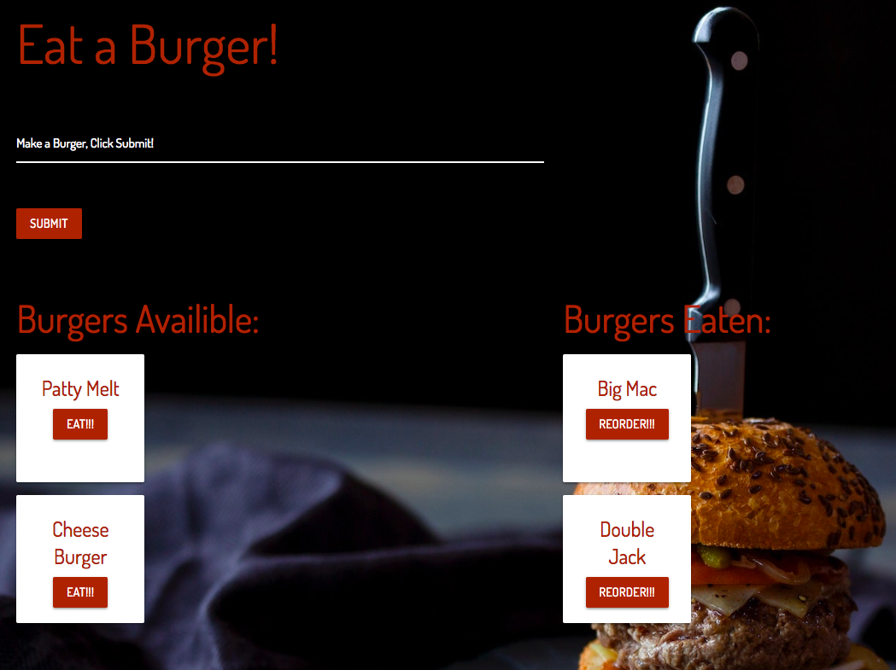

# Eat a Burger!

## About the app

This app allows a user to "eat" a burger with a button that moves it to the "Burgers Eaten" column . In addition, the user can "reorder" a burger and it will move back to the "Burgers Avalible" column. Finally, this app allows a user to create a burger by entering text into the input field and clicking submit. This places the new burger in the "Burgers Avalible" column.

## See the App
https://intense-fortress-88027.herokuapp.com/

## Technologies Used
* JavaScript
* HTML
* CSS
* MySQL
* JSON
* body-parser NPM
* Node.js
* Handlebars.js
* Express.js
* MVC model
* ORMs

## Preview
